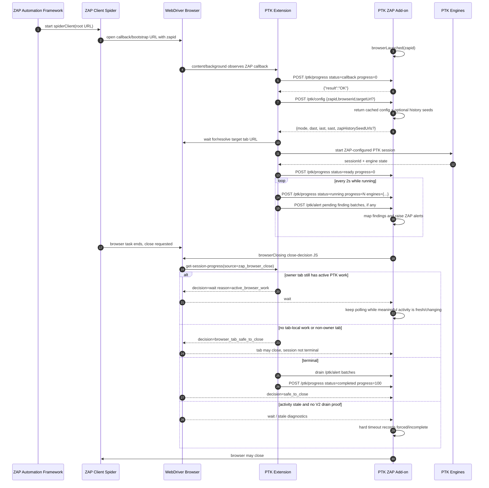
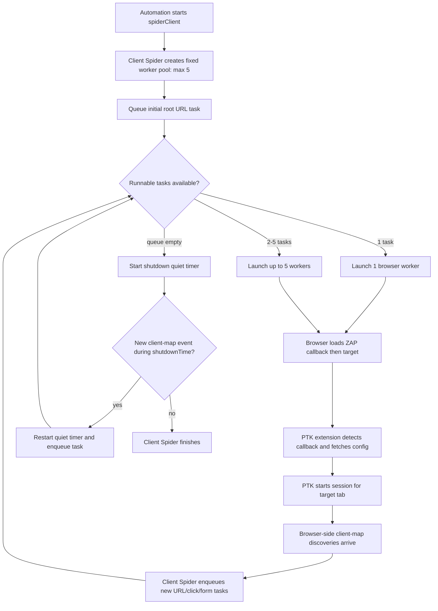
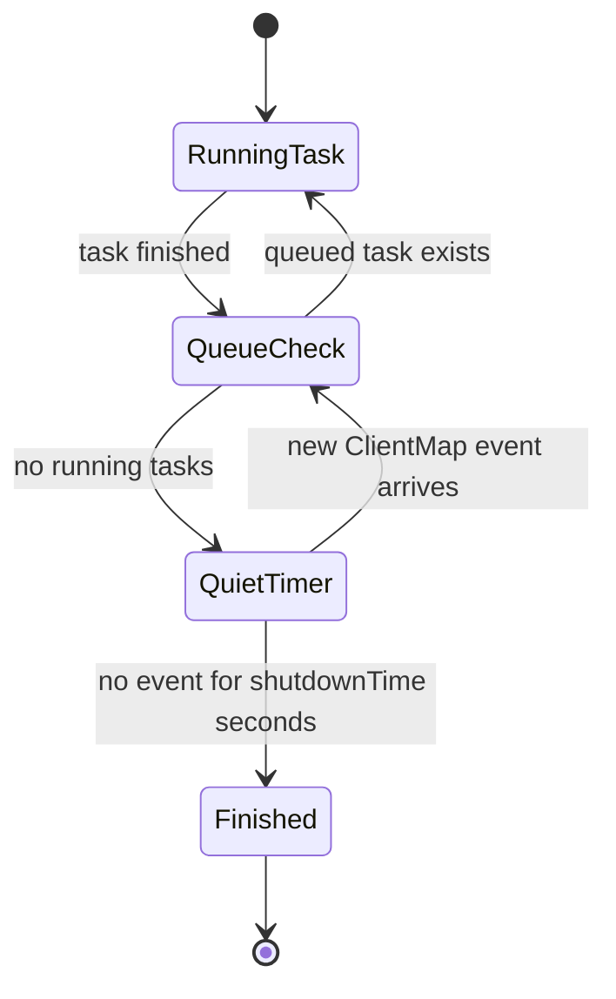
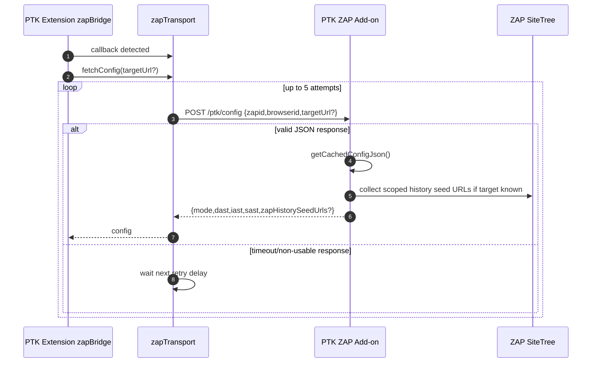
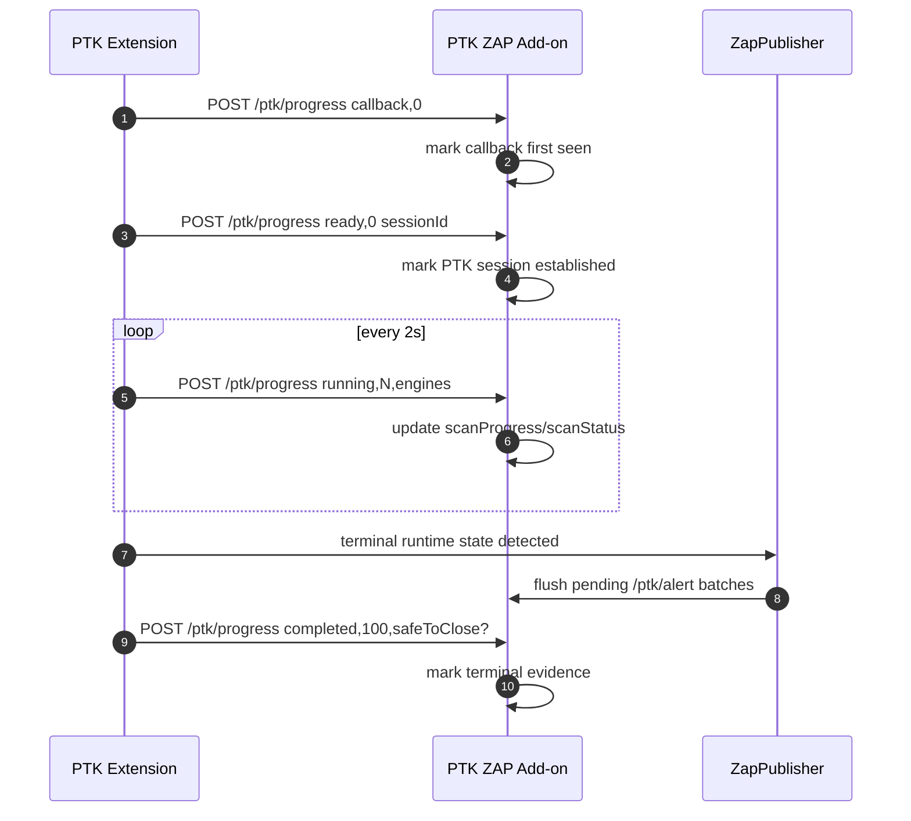
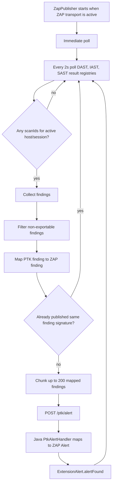
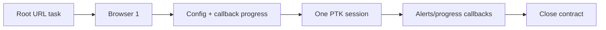
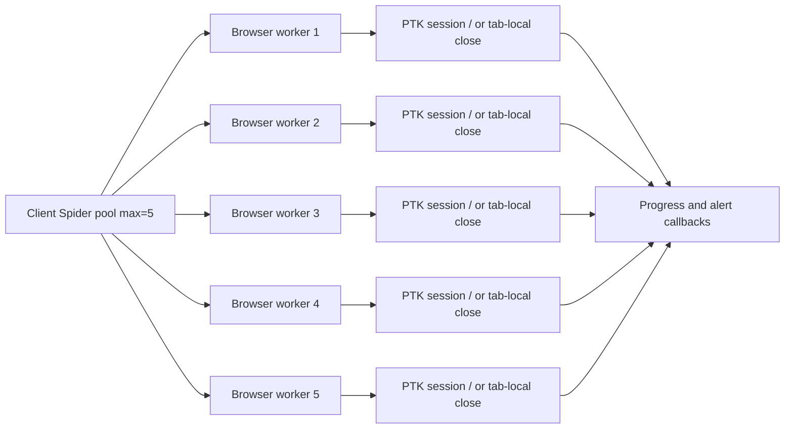
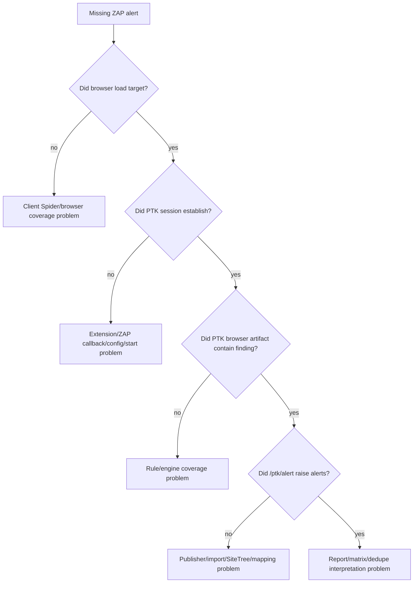

# PTK ZAP Lifecycle Contract

This document describes the runtime contract between ZAP Client Spider, the PTK ZAP add-on, and the bundled PTK browser extension.

It is intentionally detailed because most release regressions in this area happen at lifecycle boundaries, not inside one rule. The fragile parts are:

- ZAP browser lifecycle is task-based, while PTK scan lifecycle is engine-based.
- A ZAP callback/config handshake is not the same thing as a started PTK scan.
- ZAP `numberOfBrowsers` is a concurrency limit, not a guarantee that exactly that many browsers will launch.
- ZAP Client Spider can decide its queue is empty before late client-map discoveries arrive.
- PTK findings are imported asynchronously through a polling publisher, so terminal progress must wait for a finding drain.

## Actors

| Actor | Code / Source | Responsibility |
|---|---|---|
| ZAP Automation Framework | ZAP core/add-ons | Starts `spider` and `spiderClient` jobs from the YAML plan. |
| ZAP Client Spider | ZAP Client Integration add-on | Opens browser tasks, records client-side discoveries, calls browser launch/close hooks. |
| PTK ZAP add-on | `ExtensionPtk.java` | Bundles the PTK extension, exposes callback endpoints, imports findings as ZAP alerts, owns the close contract. |
| PTK browser extension | `pentestkit/src/ptk/...` | Detects ZAP callback pages, starts PTK automation sessions, publishes progress/findings. |
| PTK engines | DAST/IAST/SAST/SCA background engines | Produce findings and engine progress. |

## Callback Endpoints

ZAP provides a callback base URL like:

```text
https://zap/zapCallBackUrl/<secret>?zapenable=true&zapid=<uuid>
```

The PTK extension derives these endpoint URLs:

| Endpoint | Direction | Frequency | Purpose |
|---|---|---|---|
| `/ptk/config` | Extension to ZAP | Once per ZAP callback/start attempt, with retries | Fetch PTK mode and filtered DAST/IAST/SAST rulepacks. |
| `/ptk/progress` | Extension to ZAP | One callback handshake, then immediate and every 2s during a PTK session, plus terminal posts | Tell ZAP whether PTK has started, is running, is terminal, and whether close is safe. |
| `/ptk/alert` | Extension to ZAP | Publisher poll every 2s while ZAP is active; only sends when new/changed findings exist | Import DAST/IAST/SAST findings as ZAP alerts. |
| `/ptk/ping` | Extension to ZAP | Reserved | Currently debug/future use only. |

## Call Frequency Summary

| Call | Trigger | Rate / Limit | Notes |
|---|---|---|---|
| ZAP callback detection | Browser sees `/zapCallBackUrl/...` or ZAP bootstrap URL | Event-driven, deduped for 3s per tab/base/zapid | Activates `zapTransport`. |
| Config fetch | `zapBridge._handleZapDetectedAsync()` before auto-start | Up to 5 attempts with delays `0, 250, 1000, 2500, 5000ms`; each attempt has a `2500ms` fetch timeout | A successful JSON body ends retrying. |
| Java config build | `/ptk/config` callback | Base config cached until parameter/resource cache key changes | Rulepack filtering is cached. |
| ZAP history seed collection | `/ptk/config` when target/zapid is known | Cached for 2s per target+limit; max 500 URLs and 10,000 SiteTree nodes | Uses cached `HistoryReference.getURI()`, not message reload. |
| Callback progress | ZAP callback detected | Once per ZAP session key | Posts `progress=0,status=callback`; proves callback only, not scan start. |
| Progress monitor tick | PTK session started | Immediate tick, then every 2000ms | First tick normally posts `ready`; later ticks post running/terminal progress. |
| Finding publisher poll | ZAP active | Immediate poll on start, then every 2000ms | Sends only findings not previously published with the same signature. |
| Finding alert batch | Publisher finds pending mapped findings | Chunks of 200 findings | DAST, IAST, and SAST use separate batch schemas. |
| Terminal finding drain | Progress monitor sees terminal runtime state | Up to 4 drain passes; requires 2 stable drained passes | Prevents terminal progress before final findings reach ZAP. |
| Close decision script | ZAP calls browser close hook | Initial close script, then follow-up every 15s while Java waits | Runs inside the WebDriver browser to ask PTK whether this tab/session can close. |
| Java close wait | Non-terminal close decision | Up to 120 attempts x 1s, bounded by script budget | Follow-up scripts can convert `wait` to `safe_to_close`; hard timeout is forced/incomplete, not clean close. |

### Per-Session Call Budget

The normal one-browser case should look roughly like this:

| Boundary | Normal count | Worst / burst count | Multiplies by browser workers? |
|---|---:|---:|---|
| `browserLaunched` Java hook | 1 | 1 per WebDriver browser task | Yes. |
| `/ptk/config` | 1 successful POST | Up to 5 POST attempts if config is slow/unavailable | Yes, per ZAP callback/start attempt. |
| `/ptk/progress` callback handshake | 1 | 1 per ZAP session key; duplicate handshakes are suppressed by session key | Usually per ZAP session, not every URL. |
| `/ptk/progress` monitor | 1 immediate ready post + one post every 2s + terminal post | Extra terminal post can happen from close fallback if runtime is already terminal | Yes, per active PTK session. |
| `/ptk/alert` | 0 or more POSTs only when new findings exist | `ceil(newMappedFindings / 200)` per engine per publisher poll; terminal drain can run up to 4 passes | Yes, but de-duped per scan/finding signature. |
| `browserClosing` Java hook | 1 | 1 per WebDriver browser task close | Yes. |
| Close-decision JS | 1 initial | Follow-up once every 15s while Java is still waiting, until safe or forced | Yes, but non-owner/no-work tabs fast-close. |

In a 5-browser run, these counts can multiply by the number of actual launched browser workers. That actual worker count can be lower than `numberOfBrowsers: 5` because Client Spider uses that value as max concurrency.

## Full One-Browser Flow



## Five-Browser Flow

`numberOfBrowsers: 5` creates a Client Spider worker pool with a maximum concurrency of five. It does not mean ZAP must always launch exactly five browser windows.

Client Spider launches as many workers as there are runnable browser tasks. If the queue has one task and more tasks arrive later through client-map events, the run may use fewer than five workers and still be valid if PTK sessions and findings are healthy.



The expected release gate is not "five windows must be visible". The meaningful gate is:

- the Client Spider job starts and finishes;
- at least one ZAP-owned browser worker starts for the target;
- PTK establishes a session for the ZAP target;
- no `forced_closed` / invalid close contract is recorded;
- expected findings are imported.

## ZAP Client Spider Queue and `shutdownTime`

Client Spider is event-driven:

1. It queues the initial URL.
2. Browser workers execute tasks.
3. Client-side discoveries create new ClientMap node/component events.
4. Those events enqueue more URL/click/form tasks.
5. When no tasks are running, Client Spider starts a shutdown timer.
6. If a new event arrives during the timer, shutdown is cancelled/restarted.
7. If no event arrives during the timer, Client Spider finishes.



### Why `shutdownTime: 20`

The default Client Spider shutdown quiet window is short. In PTK/ZAP release runs, especially Edge headless multi-browser runs, a page can finish its current WebDriver task before late browser-side discoveries and PTK target observations have fully arrived.

`shutdownTime: 20` gives Client Spider a 20-second quiet window after the queue becomes empty. It does not:

- add URLs to scope;
- replay requests;
- force more browsers to launch;
- increase each page's WebDriver load timeout.

It only tells Client Spider not to declare the crawl finished until client-map events have been quiet for 20 seconds.

This is different from `pageLoadTime`. `pageLoadTime` controls the timeout/dwell for individual browser tasks. `shutdownTime` controls how long Client Spider waits after the task queue empties.

## Config Fetch Contract



Config cost is split in two:

- Base config/rulepack filtering is cached in Java and rebuilt only when the parameter/resource cache key changes.
- ZAP history seed URLs are per-request because they depend on the current target/zapid and current SiteTree state. That part is cached for 2 seconds per target and capped at 500 URLs / 10,000 SiteTree nodes.

If config cannot be fetched, the extension falls back to default PTK engine behavior rather than blocking forever. That can keep a run alive, but it is a diagnostic warning because ZAP-controlled rulepack selection may not have been applied.

## Progress Contract



Important rules:

- `status=callback,progress=0` means the callback endpoint was seen. It does not mean PTK started scanning.
- PTK session evidence requires a non-empty `sessionId` and a status other than `callback`.
- `safeToClose=true` from progress is ignored until Java has explicitly attempted a close decision for that zapid. This prevents ordinary progress from pre-authorizing browser close.
- Terminal progress is posted only after the publisher has drained pending findings, or after the bounded drain path gives up and reports a non-ready state.

## Finding Publish Contract



The publisher keeps per-scan published state. A finding is resent only if the mapped finding signature changes.

On the Java side, `/ptk/alert`:

1. Parses the batch envelope.
2. Infers engine if needed.
3. Loads PTK resources and ZAP mapping.
4. Builds a ZAP `Alert`.
5. Finds or creates a `HttpMessage`/`HistoryReference`.
6. Calls `ExtensionAlert.alertFound`.
7. Returns `alertsRaised`.

If a finding has no raw request/response, Java needs a SiteTree match for its URL. This is why "PTK found it in the browser" and "ZAP imported it" are separate gates.

## Browser Close Contract

ZAP Client Spider can call `browserClosing` because a WebDriver task is ending. That signal does not prove PTK analysis is complete.

```mermaid
flowchart TD
    A[ZAP browserClosing(zapid)] --> B{Manual mode config-only?}
    B -->|yes| C[Return not_applicable/manual and clear state]
    B -->|no| D[Wait briefly for PTK session start]
    D --> E[Run close-decision JS in WebDriver windows]
    E --> F{No PTK progress and no actionable decision?}
    F -->|yes| G[browser_session_invalid:no_ptk_progress]
    F -->|no| H{Decision browser_tab_safe_to_close?}
    H -->|yes| I[Close only this tab; do not stop global PTK session]
    H -->|no| J{Decision safe_to_close?}
    J -->|yes| K[Clear state and close]
    J -->|no| L[Poll progress every 1s]
    L --> M{Every 15s}
    M -->|follow-up| E
    L --> N{Terminal progress or safeToClose accepted?}
    N -->|yes| K
    N -->|no, budget exhausted| O[forced_closed lifecycle warning]
```

The close-decision script asks the browser extension for `get-session-progress(source=zap_browser_close)`. The extension includes `zapCloseContext`:

| Field | Meaning |
|---|---|
| `sameTab` | The WebDriver tab being closed is the same tab as the PTK session tab. |
| `matchesTargetUrl` | The closing tab URL matches the PTK session target URL. |
| `shouldStopSession` | `true` only when `sameTab || matchesTargetUrl`. |

This avoids the previous bug class where closing a non-owner tab stopped the whole PTK session.

### Close Decisions

| Decision | Reason | Java behavior |
|---|---|---|
| `safe_to_close` | `already_terminal` | Accept if terminal state is proven. |
| `browser_tab_safe_to_close` | `no_active_browser_work` | Fast close this tab; not global terminal evidence. |
| `browser_tab_safe_to_close` | `non_owner_active_work` | Fast close this non-owner tab; active PTK work belongs elsewhere. |
| `wait` | `active_browser_work` | Keep browser alive while Java sees fresh meaningful progress or alert activity. |
| `wait` | `owner_waiting_for_terminal` | Owner tab is non-terminal without concrete browser-local work in the current snapshot. Not clean-close evidence. |
| `wait` | `activity_stale_waiting_for_terminal` | Java activity evidence is stale. With the legacy extension contract this is diagnostic evidence; hard timeout records forced/incomplete. |
| `not_applicable` | `automation_disabled` / unavailable | Startup/session issue unless manual config-only. |
| `forced_closed` | close budget exhausted | Lifecycle warning; findings may be incomplete. |

## Why Close Is Activity-Based, Not Grace-Based

The close-decision script does not stop PTK because a fixed owner-tab grace elapsed. Instead, it asks the extension for current progress and returns:

- local-tab close evidence for non-owner/no-work tabs;
- terminal-safe evidence when PTK is already terminal;
- `wait` for owner-tab non-terminal work.

```text
decision=wait reason=active_browser_work stopRequested=false
```

Java then tracks meaningful activity using callback receipt time:

- canonical progress summary changes;
- alert total changes;
- terminal progress;
- accepted `safeToClose` only after ZAP has started close handling.

Heartbeat fields, elapsed time, timestamps, and wall-clock values are not activity. If activity becomes stale and the extension contract does not provide V2 publisher-drain proof, Java records stale diagnostics and ultimately `forced_closed` / incomplete on hard timeout. It must not silently request PTK stop from the close script.

Without this separation, a ZAP task-level close signal can truncate a PTK engine-level scan. That is the failure mode seen in unstable multi-browser Firing Range runs: ZAP close arrived while PTK still had remaining browser work, and imported findings were incomplete.

## One Browser vs Five Browsers

### One Browser



The one-browser path is easier to reason about because there is normally one ZAP callback, one zapid, one target tab, and one PTK session. The main risk is early close before PTK engines are terminal.

### Five Browsers



The five-browser path adds races:

- Multiple browser workers can detect callbacks close together.
- Each callback can fetch config; each fetch may retry.
- The publisher sees findings from all active managed scan IDs.
- Client Spider may close a non-owner tab while the owner tab still has active PTK work.
- A lower launched-worker count can be normal if the task queue does not fan out quickly enough.

The close contract's `non_owner_active_work` and `no_active_browser_work` fast paths are what keep non-owner tab closes from consuming the long session-stop budget.

## Logs and What They Mean

| Log | Meaning |
|---|---|
| `PTK callback type=config ...` or `PTK_TIMING phase=config.end` | Browser/extension requested config from ZAP. This is not a scan start. These are debug-level logs. |
| `PTK_BROWSER_EVIDENCE event=ptk_progress_seen progress=0 status=callback` | Callback handshake progress only. |
| `PTK_BROWSER_EVIDENCE event=ptk_session_established sessionId=...` | PTK automation session is real. |
| `PTK_BROWSER_EVIDENCE event=ptk_session_terminal` | PTK posted terminal progress to ZAP. |
| `PTK closeContract decision=wait reason=active_browser_work` | Expected if ZAP closes owner tab while PTK has active work. |
| `PTK closeContract decision=wait reason=activity_stale_waiting_for_terminal` | Java has stopped seeing meaningful progress/alert activity before terminal evidence. |
| `PTK closeContract decision=browser_tab_safe_to_close reason=non_owner_active_work` | Non-owner tab can close without stopping PTK. |
| `PTK closeContract decision=forced_closed` | Lifecycle warning; do not call the run clean without investigation. |
| `PTK /ptk/config cache hit` | Java reused cached base config. |
| `PTK /ptk/config returning N ZAP history seed URLs` | Java included scoped SiteTree/history seed URLs in config. |

## Release Gates

For release testing, do not judge stability from raw alert totals alone. Use these gates:

1. ZAP job health: `spiderClient` started and finished.
2. Browser health: at least one ZAP-owned browser worker loaded the target; lower than `numberOfBrowsers` is a warning, not automatic failure.
3. PTK health: at least one `ptk_session_established` for the target.
4. Close health: no `forced_closed`, no invalid browser session, no unbounded close waits.
5. Finding health: expected URL-alert pairs imported into ZAP.
6. Import health: browser-side PTK findings match ZAP-imported findings, or any mismatch has a clear SiteTree/mapping explanation.

## What Not To Change First

When a release run misses findings, do not first:

- add explicit Firing Range URLs to the plan;
- increase `pageLoadTime` to mask discovery timing;
- lower browser count and call it equivalent;
- suppress endpoint imports;
- treat callback progress as scan progress;
- stop PTK from Java without checking owner/non-owner close context.

Instead, locate the failing boundary:



## Current Recommended Defaults

| Setting | Value | Reason |
|---|---|---|
| `pageLoadTime` | `5` | Gives individual browser tasks enough time without hiding queue/shutdown bugs. |
| `shutdownTime` | `20` | Keeps Client Spider alive for late client-map discoveries after the queue becomes empty. |
| `numberOfBrowsers` | `1` and `5` release slices | Tests single-session and multi-worker behavior. Treat this as max concurrency. |
| Close active-work grace | `60s` | Prevents early ZAP-owned target-tab close from truncating PTK engine work. |
| Progress heartbeat | `2s` | Gives ZAP regular progress without excessive callback load. |
| Finding batch size | `200` | Avoids huge alert callback bodies while keeping import efficient. |

These defaults are there because the integration is asynchronous at every boundary: browser task lifecycle, callback detection, target resolution, engine execution, finding publishing, and close. Changing one timing knob without understanding which boundary failed is how we keep introducing release bugs.
